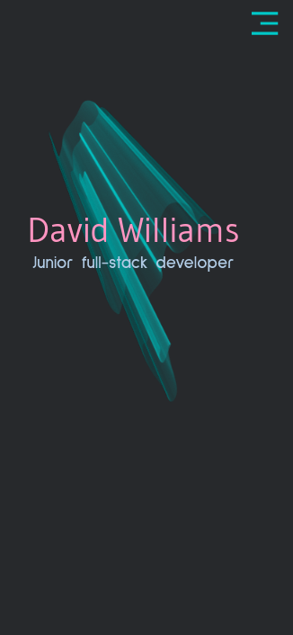
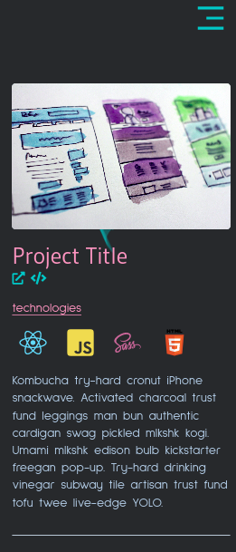
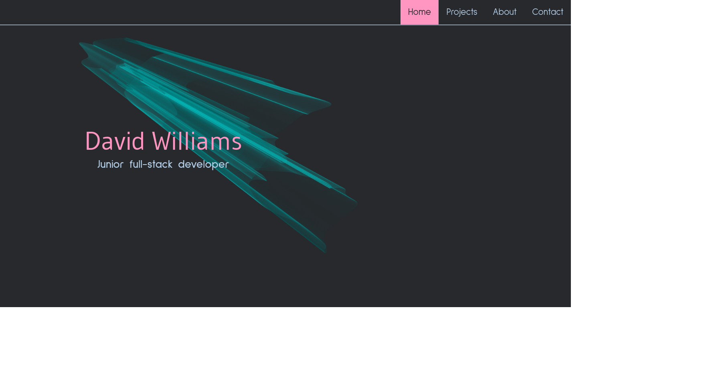
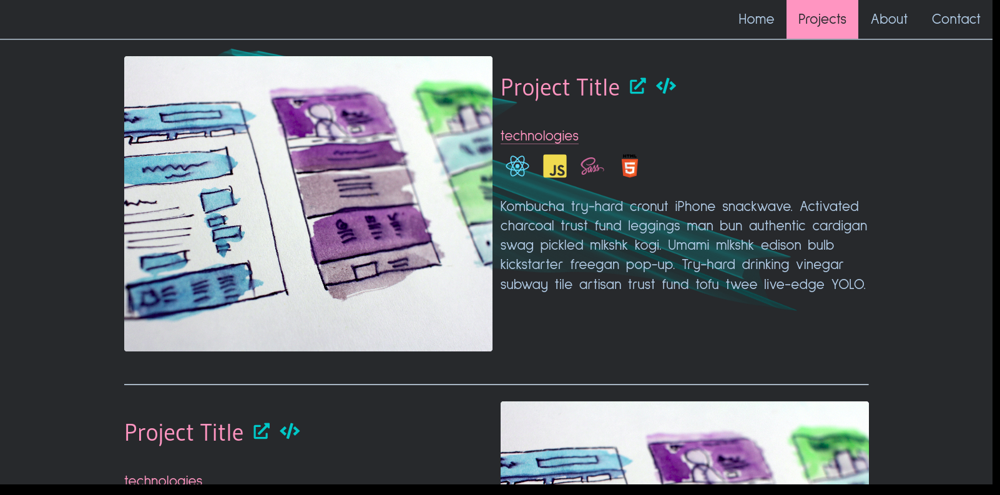

# Web Project Portfolio

### David Williams

## About this project

The aim of this website is to proide a clear, reponsive web site to showcase my web projcts.
Taking a design-first approach with wire-framing in figma, then built with **HTML**, **SCSS** and **Javascript**.

## Credits

**Icons**

- tech icons from the excellent [devicon](https://devicon.dev/)
- all other icons from the open-source library [remixicon](https://remixicon.com/)

**fonts**

- open-source fonts _Gudea_ and _Sulpur point_ courtesy of [Google fonts](https://fonts.google.com/)

**misc**

- a great source for Javascript concepts with examples, [Javascript tutorials](https://www.javascripttutorial.net)

- many thanks to Ollie and Rob at [nology](https://nology.io/) for imparting their wisdom, and my fellow students for their help and support

## Screenshots

### Mobile

### DEsktop

